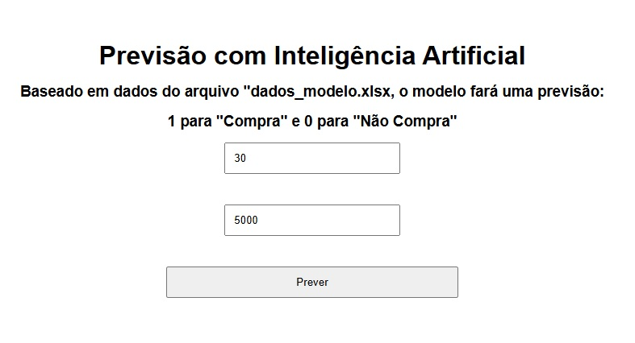

# 🤖 API de Previsão com Inteligência Artificial

Este projeto é uma aplicação completa de Machine Learning com interface web, capaz de realizar previsões com base em dados de entrada fornecidos pelo usuário.

---

## 🚀 Funcionalidades

- 📊 Modelo de Machine Learning treinado com Scikit-learn
- 🌐 API REST desenvolvida com Flask
- 💻 Interface web simples com HTML, CSS e JavaScript
- 🔄 Comunicação em tempo real entre frontend e backend
- 📈 Previsão baseada em idade e salário

---

## 🧠 Como funciona

O modelo foi treinado com dados contendo:

- Idade
- Salário
- Resultado: Comprou (1) ou Não Comprou (0)

A aplicação recebe os dados via interface web, envia para a API e retorna uma previsão em tempo real.

---

## 🛠️ Tecnologias utilizadas

- Python
- Flask
- Scikit-learn
- Pandas
- Joblib
- HTML, CSS e JavaScript

---

## 📂 Estrutura do projeto
├── app.py
├── modelo.pkl
├── requirements.txt
├── Procfile
├── index.html
├── dados_modelo.xlsx

## ▶️ Como executar localmente

1. Clone o repositório:

2. Instale as dependências:
pip install -r requirements.txt

3. Execute a API:
python app.py

4. Abra o arquivo index.html no navegador

👨‍💻 Autor:
Werner Krause Soares

Projeto desenvolvido como parte dos estudos em Engenharia de IA.
